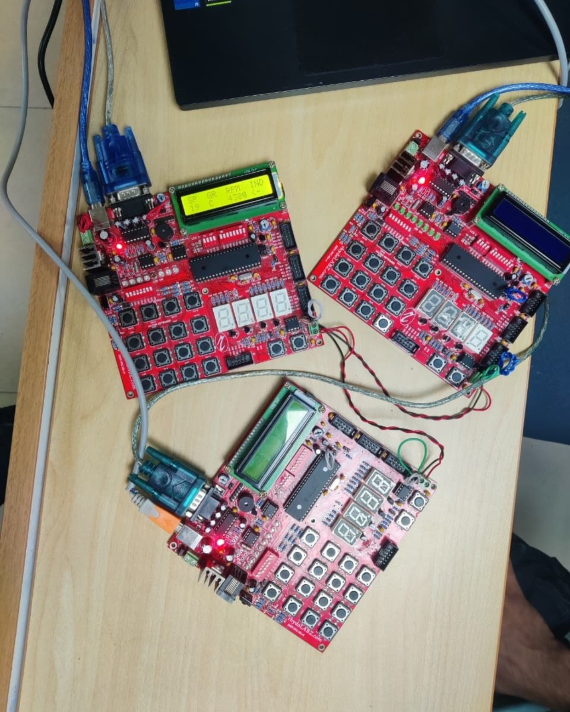
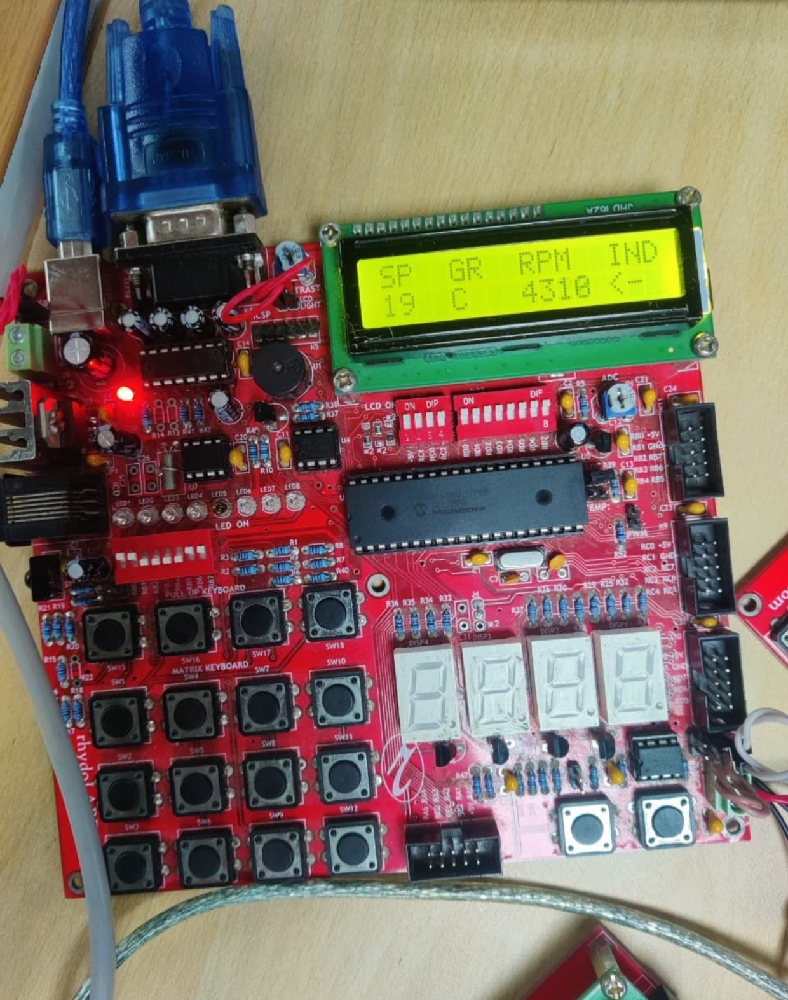

# 🚗 CAN-Based Automotive Dashboard System

## 👨‍💻 Author

Om Bidikar

---

## 📌 About the Project

This project implements a **multi-ECU automotive dashboard system** using **CAN (Controller Area Network)** communication.

The system consists of **three ECUs** communicating over CAN:

* **ECU1 (Sensor Node)** → Reads speed & gear
* **ECU2 (Processing Node)** → Processes RPM & indicators
* **ECU3 (Dashboard Node)** → Displays data on CLCD and controls indicators

This simulates a **real automotive embedded system architecture**, where multiple control units communicate over a shared bus.

---

## 🧠 System Architecture

```
ECU1 (Sensors) ──┐
                 ├── CAN BUS ──> ECU3 (Dashboard Display)
ECU2 (Processing)┘
```

---

## ✨ Features

* Multi-ECU communication using CAN protocol
* Real-time dashboard display
* Speed, Gear, RPM & Indicator monitoring
* CLCD-based UI display
* GPIO-based indicator control
* Modular embedded C design

---

## 📁 Project Structure

```
CAN-Automotive-Dashboard/
│
├── ECU1/
├── ECU2/
├── ECU3/
│
├── assets/
│   ├── circuit.png
│   ├── data.png
│
├── README.md
```

---

## ⚙️ Technologies Used

* Embedded C
* MPLAB X IDE
* PIC Microcontroller
* CAN Protocol
* CLCD Display
* GPIO
* Timer Interrupts

---

## ▶️ How to Run

1. Open each ECU project in **MPLAB X IDE**
2. Build and flash each ECU
3. Connect ECUs via CAN bus
4. Power the system
5. Observe output on CLCD

---

## 📸 Output

### 🔌 Hardware Setup (Multi-ECU CAN Network)



---

### 📟 Dashboard Output (Real-Time Data)



---

## 🧠 Concepts Used

* CAN Communication (Multi-node system)
* Embedded System Design
* Inter-ECU Data Exchange
* Interrupt Handling
* Modular Programming in C

---

## ⚠️ Limitations

* Basic CAN implementation (no advanced error handling)
* Demo-scale setup
* Limited UI

---

## 🚀 Future Improvements

* Add CAN error detection & filtering
* Extend with more sensors
* Upgrade to graphical display
* Add RTOS-based scheduling

---

## 📘 License

This project is for learning and demonstration purposes.
